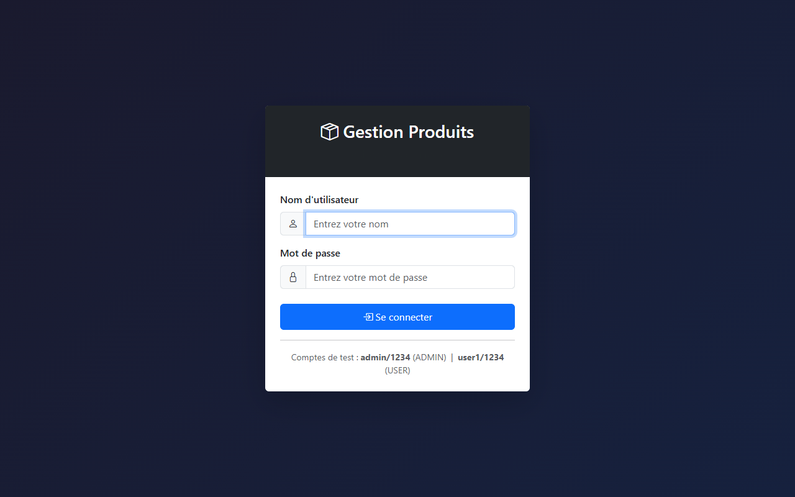
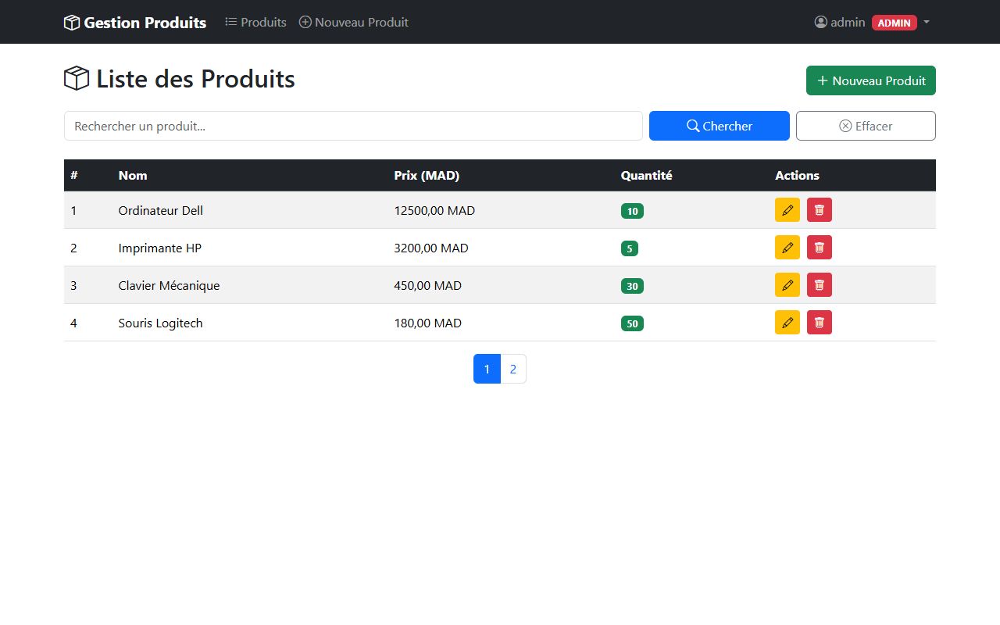
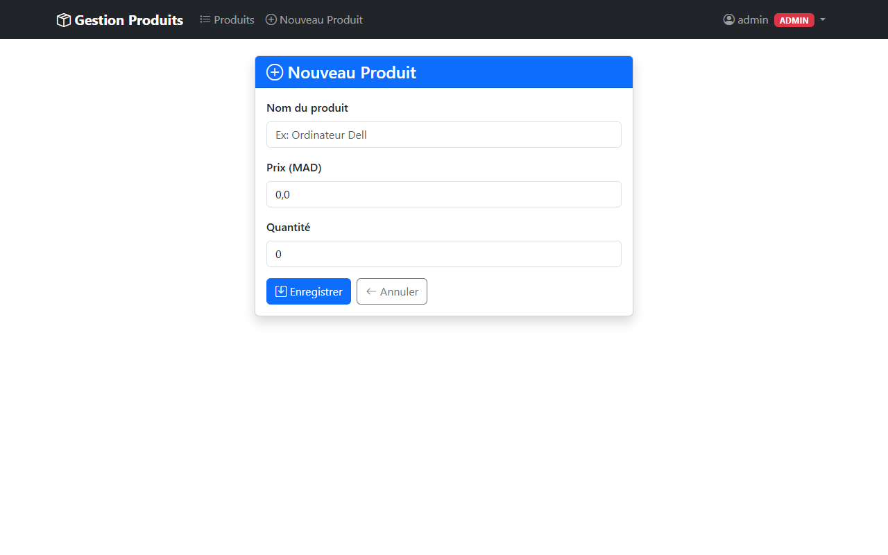
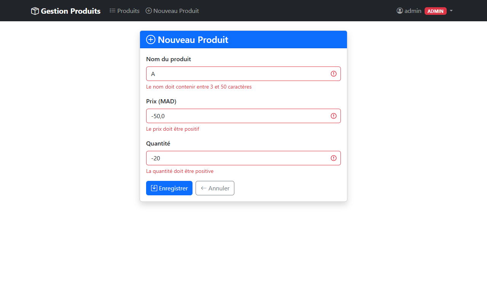
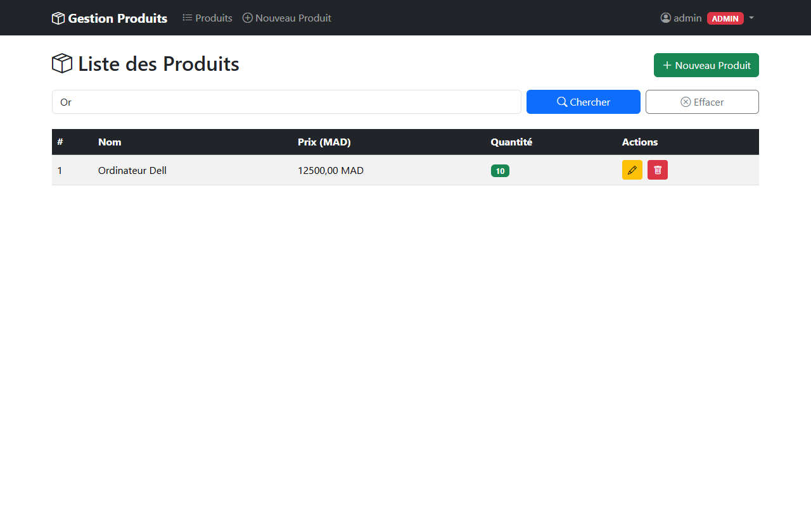
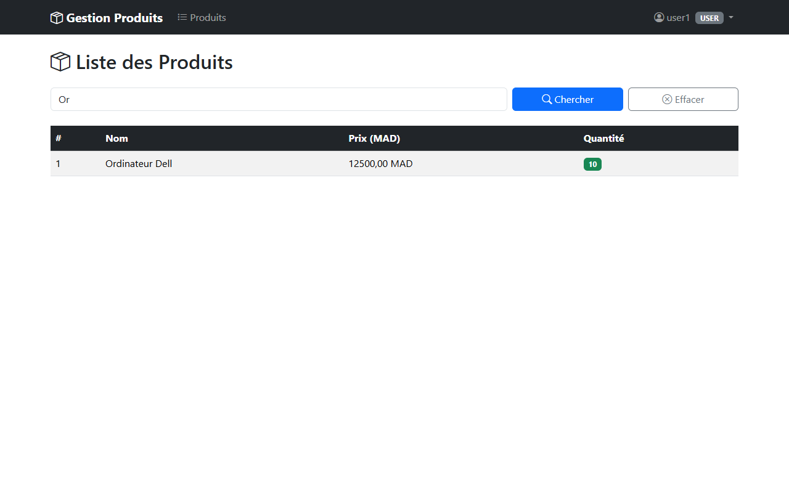

# TP3 — Application Web Spring Boot

## C'est quoi cette application ?

Une application web complète pour gérer des produits. On peut voir la liste des produits, en ajouter, les modifier et les supprimer — le tout avec une interface graphique dans le navigateur, une connexion sécurisée, et une base de données.

C'est comme un mini Amazon en local.

---

## Aperçu de l'application

### Page de connexion


### Liste des produits (vue Admin)


### Formulaire — Ajout d'un produit


### Formulaire — Erreurs de validation


### Formulaire — Modification d'un produit


### Recherche de produits


### Liste des produits (vue User — lecture seule, sans boutons d'action)


---

## Comment lancer l'application

```bash
cd tp3-webapp
mvn spring-boot:run
```

Puis ouvrir le navigateur sur : **http://localhost:8080**

---

## Comptes de connexion

| Utilisateur | Mot de passe | Ce qu'il peut faire |
|-------------|-------------|---------------------|
| `admin` | `1234` | Tout : voir, ajouter, modifier, supprimer |
| `user1` | `1234` | Voir la liste uniquement |
| `user2` | `1234` | Voir la liste uniquement |

---

## Ce qu'on peut faire dans l'application

### 1. Voir la liste des produits
La page principale affiche tous les produits dans un tableau avec leur nom, prix et quantité.
Les produits avec une quantité inférieure à 5 sont affichés en rouge (stock faible).

### 2. Rechercher un produit
Une barre de recherche permet de filtrer les produits par nom en temps réel.

### 3. Pagination
Les produits sont affichés par page (4 par page). Des boutons permettent de naviguer entre les pages.

### 4. Ajouter un produit (admin seulement)
Un formulaire avec validation :
- Le nom est obligatoire (entre 3 et 50 caractères)
- Le prix doit être positif
- La quantité doit être positive
Si on oublie un champ ou met une valeur incorrecte, un message d'erreur s'affiche directement sous le champ.

### 5. Modifier un produit (admin seulement)
Le même formulaire que l'ajout, mais pré-rempli avec les données existantes.

### 6. Supprimer un produit (admin seulement)
Un bouton rouge avec une confirmation avant suppression.

### 7. Se déconnecter
Un bouton dans la barre de navigation en haut à droite.

---

## Comment c'est construit

L'application suit le pattern **MVC** (Modèle - Vue - Contrôleur) :

```
Navigateur
    │
    ▼
ProductController (Contrôleur)   ← reçoit les requêtes HTTP
    │
    ├──► ProductRepository (Modèle)  ← lit/écrit dans la base H2
    │
    └──► Thymeleaf (Vue)             ← génère les pages HTML
```

### La sécurité (Spring Security)

Quand on arrive sur le site, Spring Security vérifie si on est connecté.
Si non, il redirige automatiquement vers la page de login.

Après connexion, Spring vérifie le rôle de l'utilisateur à chaque action :
- `USER` → peut seulement voir
- `ADMIN` → peut tout faire

Si un `USER` essaie d'accéder à `/products/delete/...`, il reçoit une page "403 Accès Refusé".

### La validation des formulaires (Spring Validation)

Les annotations sur l'entité définissent les règles :
```java
@NotBlank(message = "Le nom est obligatoire")
@Size(min = 3, max = 50, message = "Entre 3 et 50 caractères")
private String name;

@Min(value = 0, message = "Le prix doit être positif")
private double price;
```

Si les données sont invalides, le contrôleur renvoie le formulaire avec les messages d'erreur. On ne touche pas à la base de données.

### Le template partagé (Thymeleaf Layout)

Toutes les pages utilisent le même template de base (`layout/template.html`) qui contient :
- La barre de navigation en haut
- Le pied de page
- Les liens Bootstrap

Chaque page (liste, formulaire...) injecte juste son contenu dans ce template. On n'a pas à répéter la navbar sur chaque page.

---

## Structure du projet

```
tp3-webapp/
├── entities/
│   └── Product.java              ← L'objet produit avec les règles de validation
├── repositories/
│   └── ProductRepository.java    ← Accès BDD (recherche + pagination)
├── controllers/
│   ├── ProductController.java    ← Gère toutes les actions sur les produits
│   └── AuthController.java       ← Gère la page de login et les erreurs 403
├── security/
│   └── SecurityConfig.java       ← Règles de sécurité (qui peut faire quoi)
└── resources/
    ├── application.properties    ← Configuration BDD et Thymeleaf
    └── templates/
        ├── layout/
        │   └── template.html     ← Squelette commun à toutes les pages
        ├── products/
        │   ├── list.html         ← Page liste des produits
        │   └── form.html         ← Formulaire ajout/édition
        └── security/
            ├── login.html        ← Page de connexion
            └── 403.html          ← Page accès refusé
```

---

## Passer de H2 à MySQL

Pour utiliser MySQL au lieu de H2, modifier `application.properties` :

```properties
# Commenter les lignes H2 et décommenter MySQL :
spring.datasource.url=jdbc:mysql://localhost:3306/tp3db?createDatabaseIfNotExist=true
spring.datasource.username=root
spring.datasource.password=
spring.jpa.database-platform=org.hibernate.dialect.MySQLDialect
spring.jpa.hibernate.ddl-auto=update
```

---

## Ce qu'on a appris

- **Spring MVC** : comment les requêtes HTTP arrivent au contrôleur et comment on renvoie des pages HTML
- **Thymeleaf** : générer du HTML dynamique côté serveur avec des données Java
- **Thymeleaf Layout Dialect** : partager un template commun entre toutes les pages
- **Bootstrap 5** : rendre l'interface jolie et responsive sans écrire de CSS
- **Spring Security** : protéger les routes selon le rôle de l'utilisateur
- **Spring Validation** : valider les formulaires et afficher les erreurs
- **Pagination** : ne pas charger toute la base de données d'un coup
- **H2 → MySQL** : comment changer de base de données sans toucher au code Java
