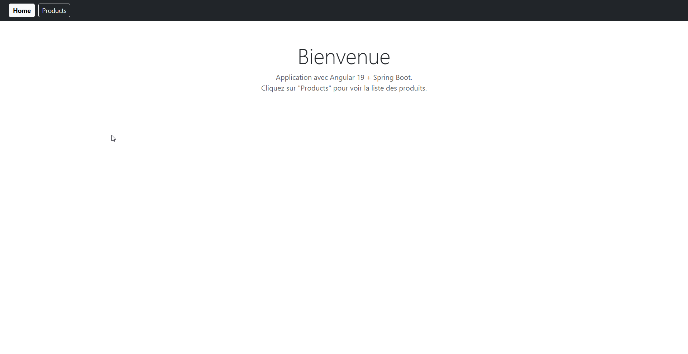
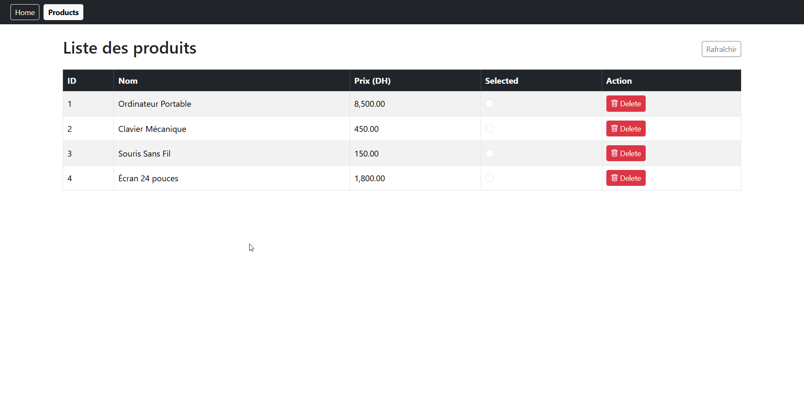
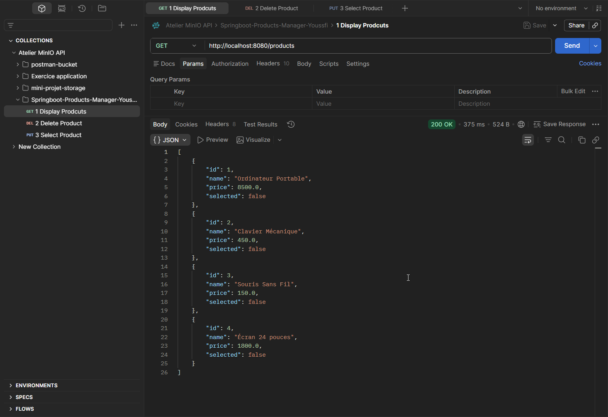
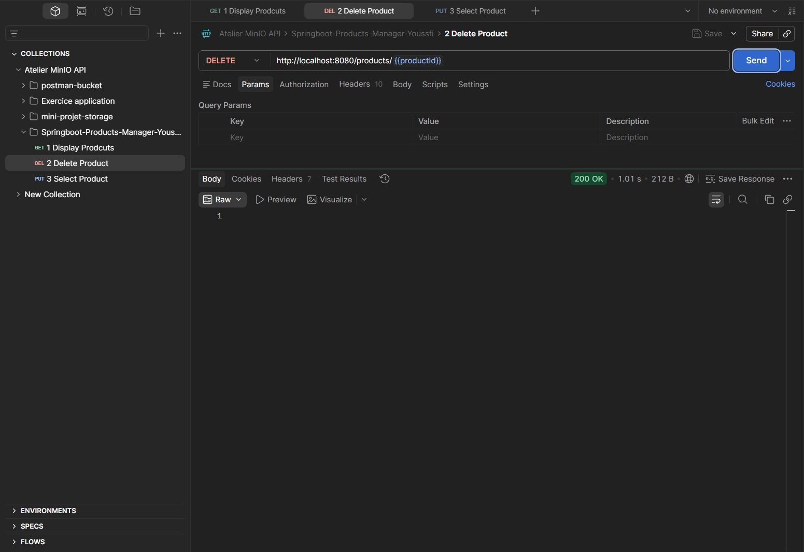
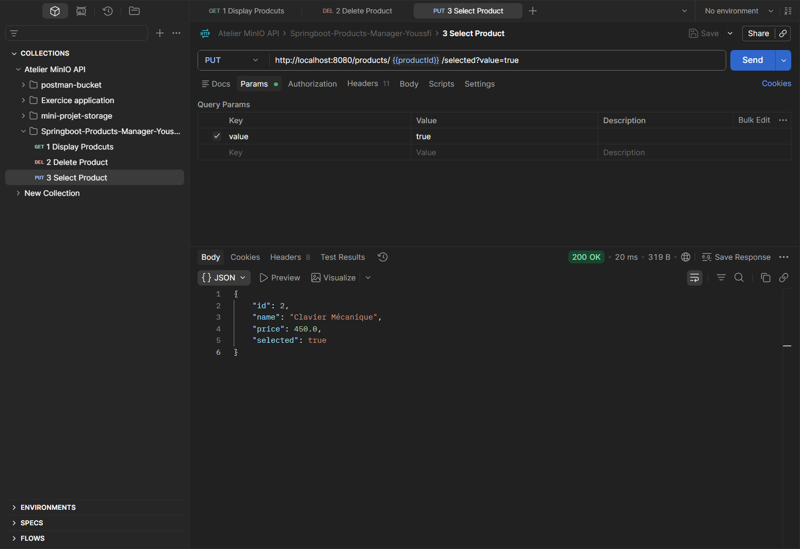
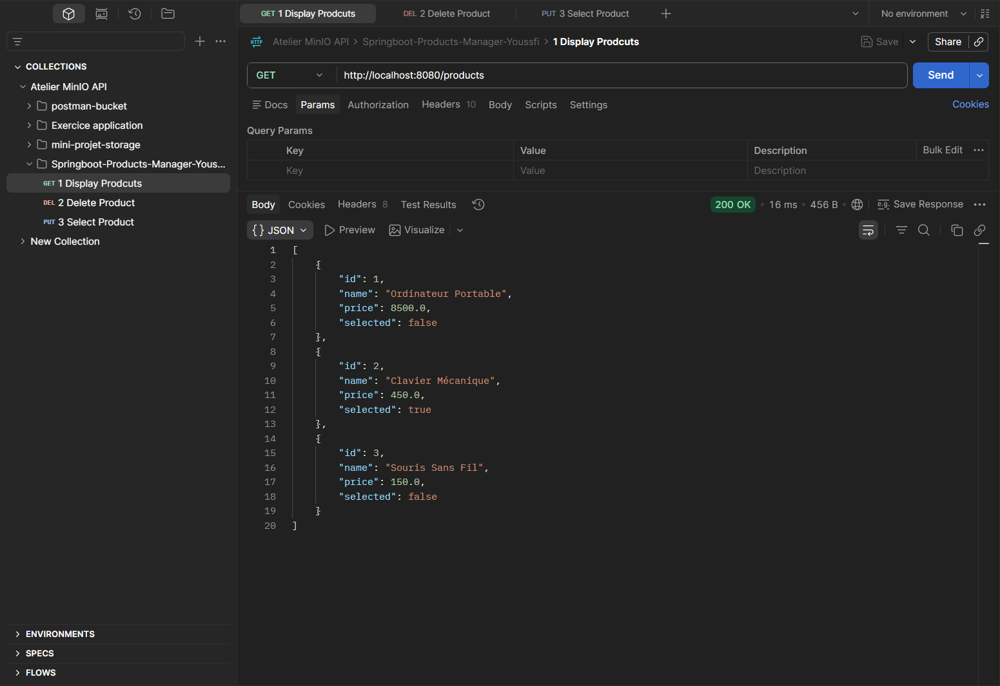

# TP Angular + Spring Boot

Petite app pour gérer une liste de produits. Front en Angular 19 (standalone) avec Bootstrap, back en Spring Boot avec une base H2.

## Ce que ça fait

- Page Home et page Products avec navigation
- Liste des produits dans un tableau
- Une colonne "Selected" (radio bouton qu'on peut cocher/décocher, sauvegardé en base)
- Un bouton Delete (avec icône et confirmation avant suppression)

## Comment lancer

**Backend** (port 8080) :
```
cd backend
mvn clean package -DskipTests
java -jar target/productapp-1.0.0.jar
```

**Frontend** (port 4200) :
```
cd frontend
npm install
npx ng serve
```

Puis ouvrir http://localhost:4200

## Captures d'écran

**Page Home**



**Page Products**



## API (pour tester avec Postman)

| Méthode | URL | Description |
|---|---|---|
| GET | `http://localhost:8080/products` | Liste tous les produits |
| DELETE | `http://localhost:8080/products/{id}` | Supprime un produit |
| PUT | `http://localhost:8080/products/{id}/selected?value=true` | Change l'état "selected" (`true` ou `false`) |

**GET /products**



**DELETE /products/{id}**



**GET après le DELETE** (le produit a bien disparu)


**PUT /products/{id}/selected?value=true**



**GET après le PUT** (le produit 2 est passé à `selected: true`)



## Stack

- Angular 19 (standalone components, pas de modules)
- Bootstrap 5 + Bootstrap Icons
- Spring Boot 3.3 + Spring Data JPA
- Base H2 en mémoire (les données sont remises à zéro à chaque redémarrage du backend, via `data.sql`)

## Structure

```
backend/
  src/main/java/com/youssfi/productapp/
    model/        -> entité Product (JPA)
    repository/   -> ProductRepository
    controller/   -> ProductRestController (GET, DELETE, PUT /selected)

frontend/
  src/app/
    models/       -> interface Product
    services/     -> ProductService (appels HTTP)
    pages/home/   -> page d'accueil
    pages/products/ -> page liste produits
```

## Notes

- CORS est ouvert pour `http://localhost:4200` côté backend.
- La console H2 est accessible sur http://localhost:8080/h2-console (JDBC URL: `jdbc:h2:mem:productdb`, user `sa`, sans mot de passe).
